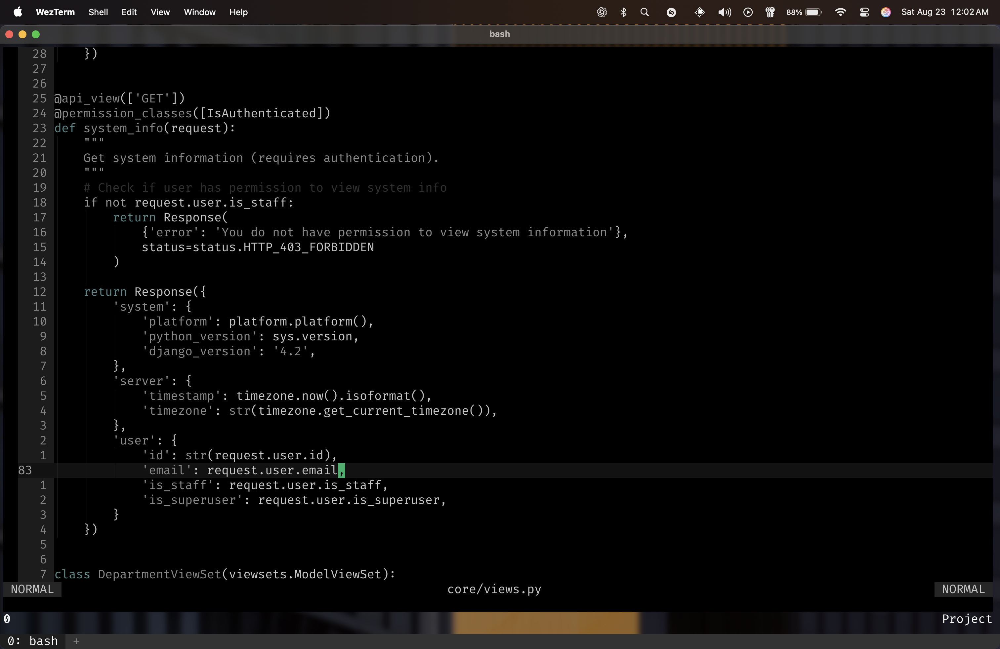
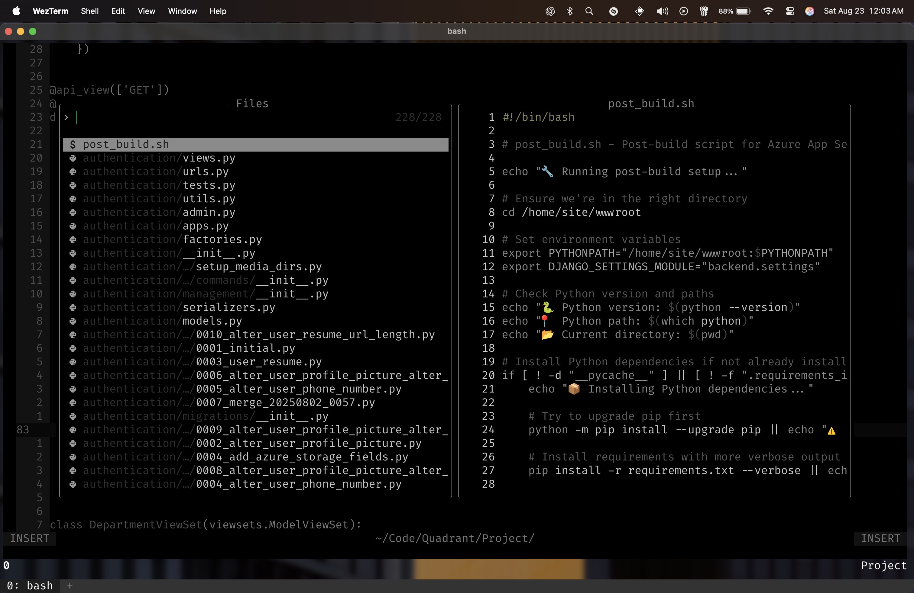
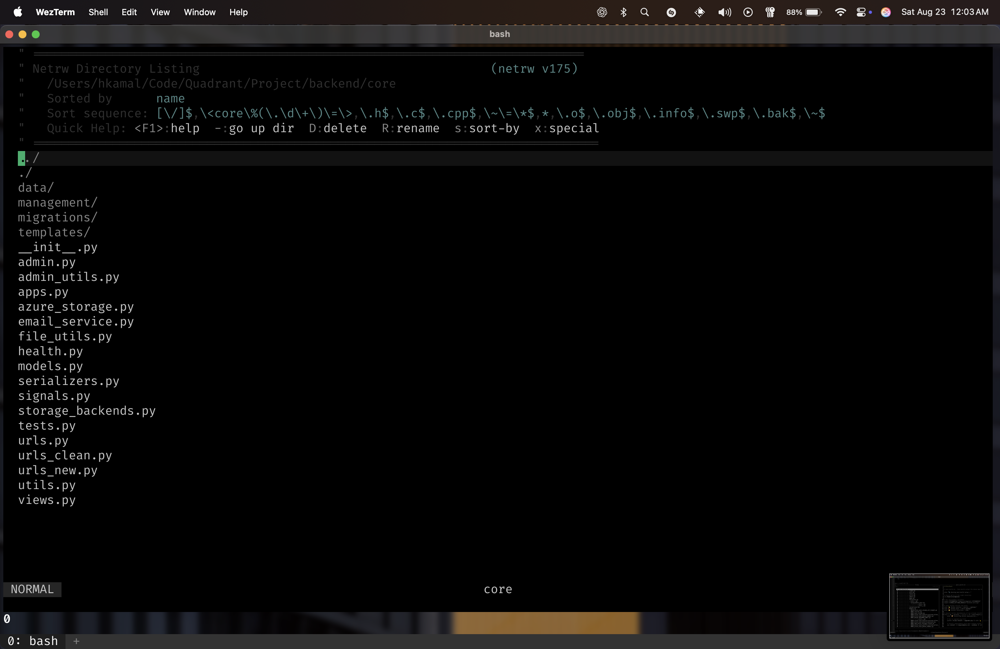
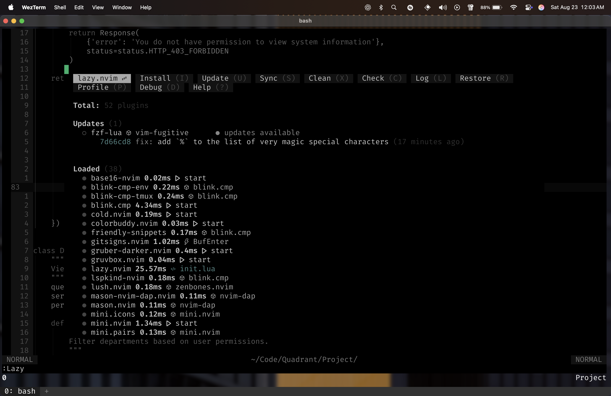
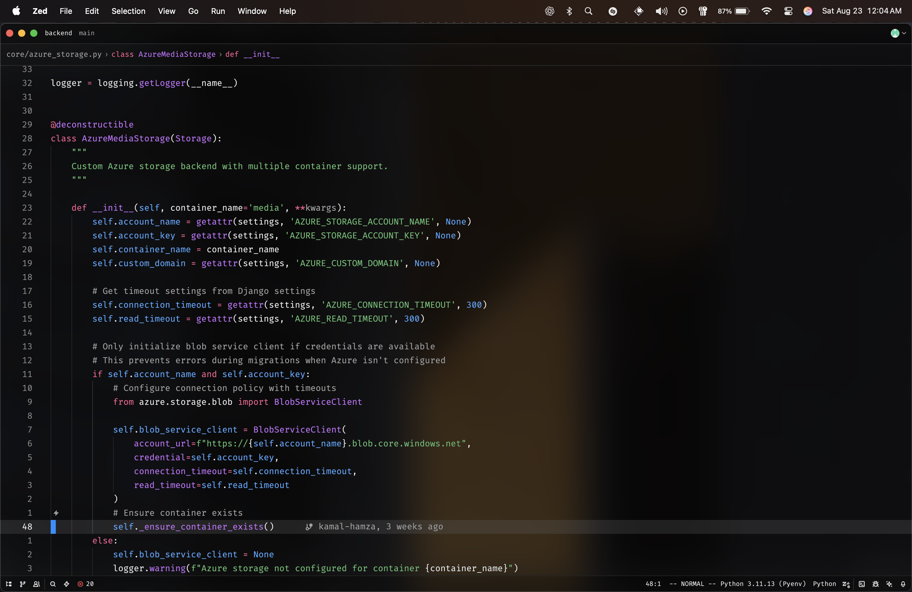
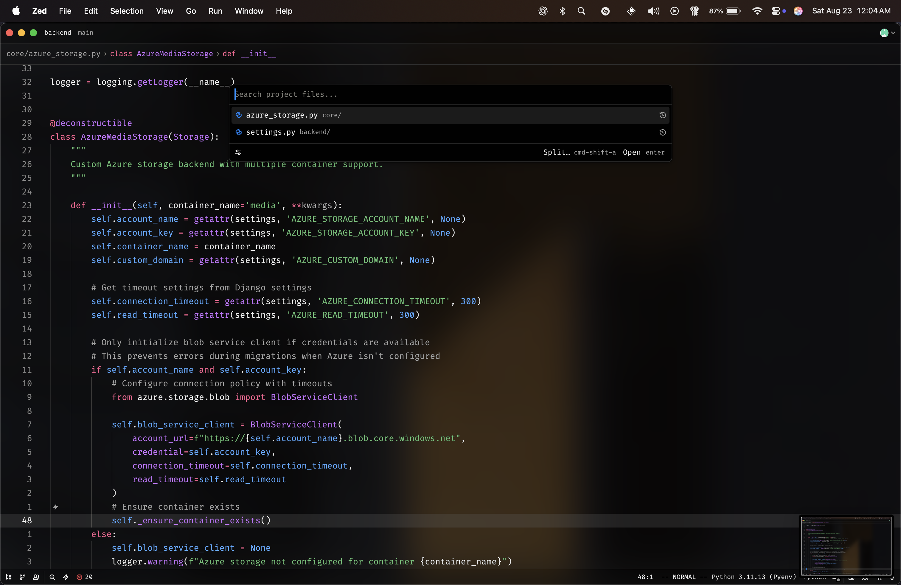
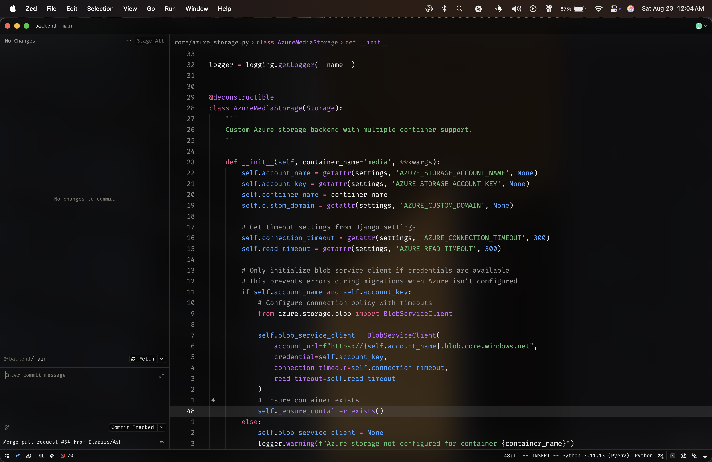
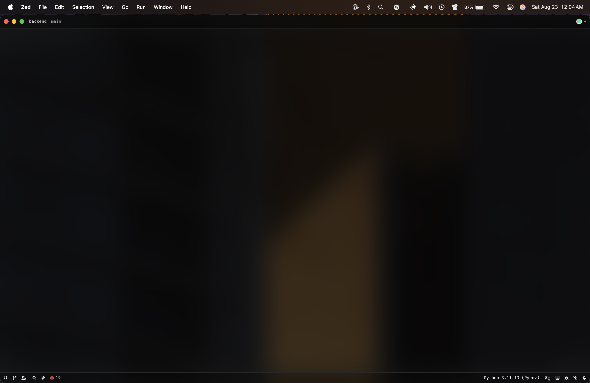
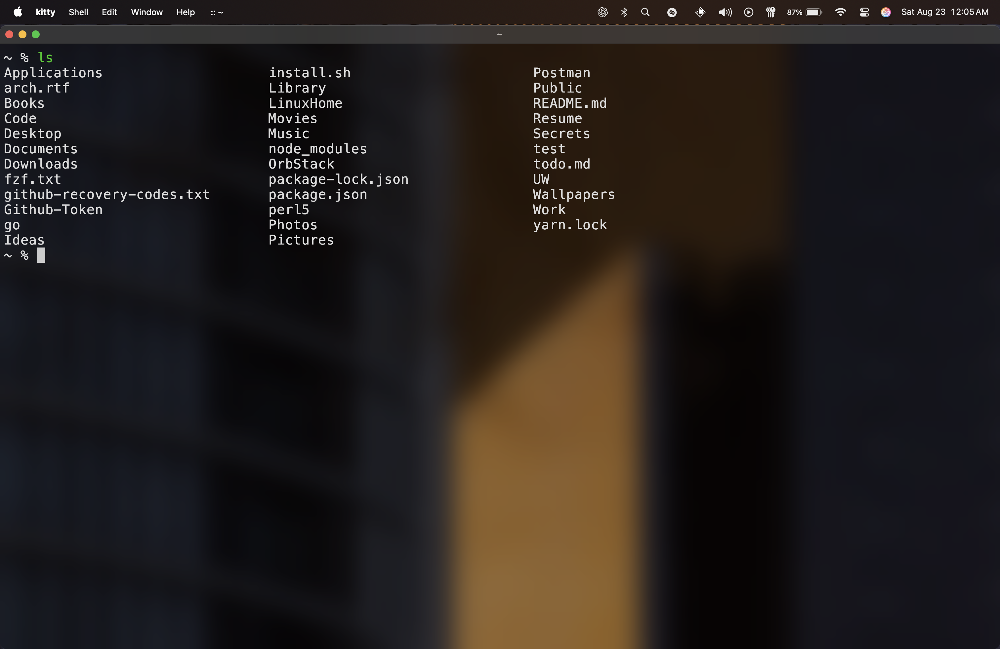
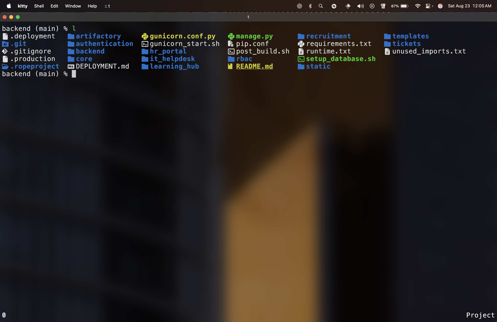

# My Dotfiles

These are my personal dotfiles, which I use to configure my development environment across macOS, Arch Linux, and Windows. They are managed with `chezmoi`, which allows for easy installation and management of configuration files across multiple machines.

# Install

To install and apply the dotfiles to your system, run this one-liner:

```bash
sh -c "$(curl -fsLS get.chezmoi.io)" -- init --apply kamal-hamza
```

# Features

- **Cross-Platform Support:** These dotfiles are designed to be compatible with macOS, Arch Linux, and Windows, with platform-specific configurations handled by `chezmoi`.
- **Automated Setup:** The installation scripts automate the setup process by installing necessary packages and applications for each operating system.
- **Custom Neovim Configuration:** A comprehensive Neovim setup with a wide range of plugins for a better development experience. This includes LSP support, a debugger, and a variety of other tools.
- **Script Management:** A collection of scripts to automate common tasks, such as creating and deleting projects.

# Shell Customizations

My shell is customized for a more efficient and user-friendly experience. Here are some of the key features:

- **Aliases:** I use a variety of aliases to shorten common commands. For example, `l` is an alias for `ls -la`.
- **Autosuggestions:** The shell provides autosuggestions based on your command history, which can be completed by pressing the right arrow key.
- **Syntax Highlighting:** Commands and their arguments are highlighted in different colors, making it easier to read and debug commands.

# Configured Applications

## Terminals

- **WezTerm:** A GPU-accelerated cross-platform terminal emulator and multiplexer.
- **Kitty:** A fast, feature-rich, GPU-based terminal emulator.

## Editors

- **Neovim:** A highly extensible Vim-based text editor.
- **Zed:** A lightning-fast, collaborative code editor written in Rust.

## Shell

- **Zsh:** A powerful shell with scripting capabilities.
- **PowerShell:** A cross-platform task automation solution. My dotfiles include a number of custom PowerShell scripts for Windows.

## Tools

- **Chezmoi:** A tool for managing dotfiles across multiple machines.
- **fzf:** A command-line fuzzy finder.
- **tmux:** A terminal multiplexer.
- **mpd/ncmpcpp:** A terminal-based music player setup.

## Other

- **Hyprland:** A dynamic tiling Wayland compositor with a focus on animations.
- **Aerospace:** An i3-like tiling window manager for macOS.
- **Yazi:** A terminal file manager written in Rust.

# Aliases

| Alias | Command                                  | Description                                             |
| ----- | ---------------------------------------- | ------------------------------------------------------- |
| tree  | tree -I "node_modules\|bower_components" | Show directory tree, ignoring common dependency folders |
| la    | ls -la                                   | List all files with details                             |
| l     | eza --all --icons                        | List all files with icons (modern `ls`)                 |
| cls   | clear                                    | Clear the terminal                                      |
| v     | nvim                                     | Open Neovim                                             |
| vi    | nvim                                     | Open Neovim                                             |
| t     | tmux a                                   | Attach to a tmux session                                |
| cd    | z                                        | Jump to frequently used directories (`z` command)       |
| y     | yazi                                     | Launch Yazi (custom tool)                               |
| gs    | git status --short                       | Show short git status                                   |
| fman  | compgen -c \| fzf \| xargs man           | Search available commands and open man page             |
| what  | tldr                                     | Get simplified man pages (tldr)                         |
| tt    | executable_tmux-new                      | Launch new tmux session (custom executable)             |
| ccp   | executable_create-project                | Create a new project (custom executable)                |
| dp    | executable_delete-project                | Delete a project (custom executable)                    |
| m     | executable_man                           | Custom man/executable helper                            |
| bb    | executable_branch-change                 | Change git branches interactively (custom)              |
| zed   | zeditor                                  | Launch Z editor (custom)                                |

# Supported OS

- Arch Linux
- macOS
- Windows

# Screenshots

## Nvim






## Zed







## Kitty




## Wezterm


## Yazi


